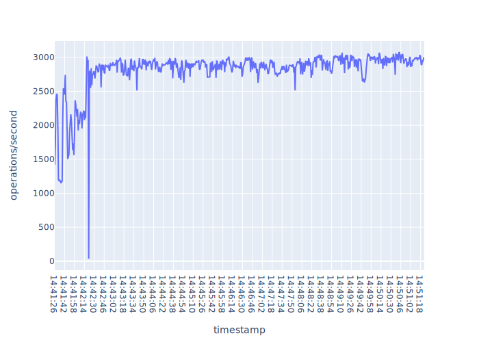
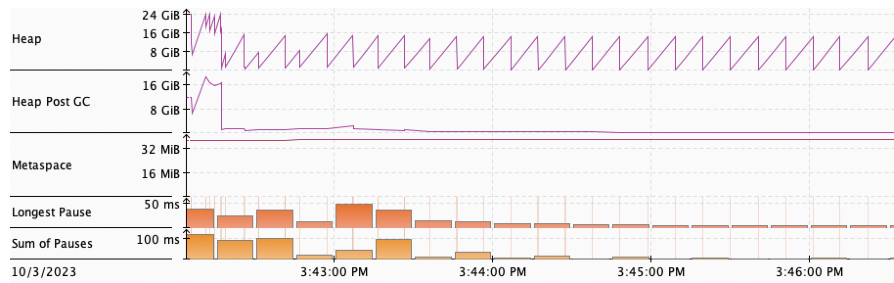
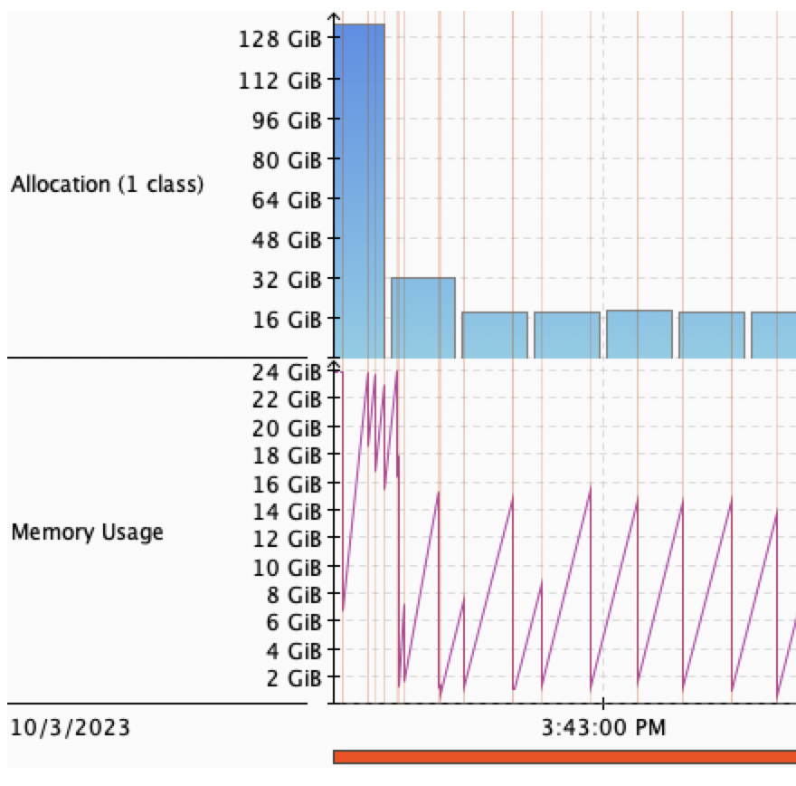
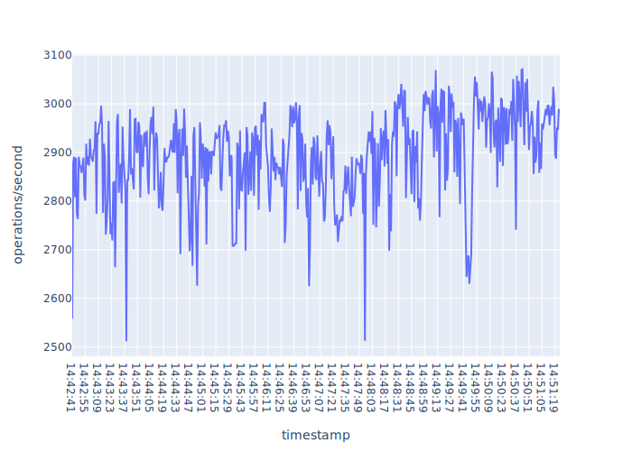
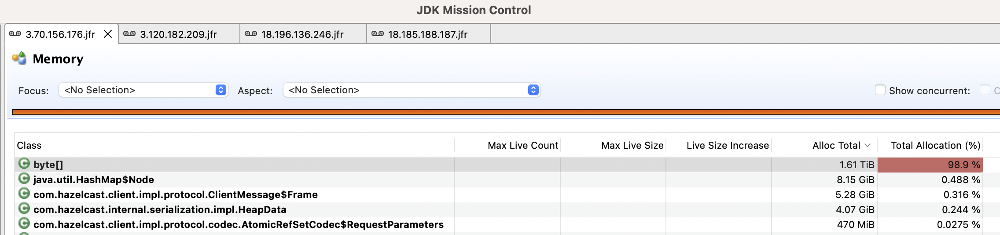
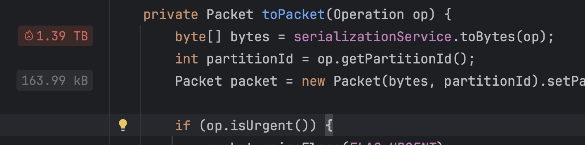

_Overview._ Investigation into performance drop-offs w.r.t. throughtout for
`IAtomicReference#set(T)`. 128kb key-value. `5.3.2` open source. Test runs for 10 minutes. The exact
details of the test scenario are [here](test-iatomicreference-set128kb-10mins.yaml).

## Summary

The I/O subsystem dominates memory and CPU profiling. The memory allocations are dominated by
`byte[]` which are generally very short lived and within the context of the test scenarion it is a
side effect of reading and writing to the network, e.g. `AppendRequestOp` and
`AppendSuccessResponseOp`. Everything else is immaterial as the serde subsystem creates a lot of
`byte[]` during the test (you can see one member later that allocates ~1.61TiB of `byte[]`). The
`byte[]` allocations and manipulation are a side effect of the protocol itself -- we are constantly
sendinging messages between members; importantly, when we normalise the throughput graph the
standard deviation is relatively low: ~3% -- things are pretty stable, even under heavy load (the
test scenario in total performs 1,680,768 `set` operations). Note though that this simulation
reduces the cost of networking as we have a `cluster` placement group which all VMs are a member of:
The higher the network latencies the more pressure the system will come under due to longer life
times of `byte[]`s. It's worth noting that under the test conditions the high rate of `byte[]`
allocations and their resp. processing does not adversly affect the throughput of the system from
the client's perspective: only the raw data looks quite scary -- if you abstract this then the
service operates stably within a relatively small tolerance as noted previously.

Briefly we can map the findings explained here to
[this](https://htmlpreview.github.io/?https://github.com/gbarnett-hz/perf-notes/blob/main/iatomicreference/set-cas-casopt-alter/report.html)
previous report. These tests were run for 120 seconds: for CP and `perftest` combination this is not
long enough as the first 60-75 seconds yield significant variability in operations/second and memory
allocations due to network traffic. Therefore, applying the findings by normalising that graph you
see something that is inline with what I present in the 'Throughput > Adjusted' section. Why did we
test `set`? Because `set` has the same drop-off properties as the oother operations
[this](https://htmlpreview.github.io/?https://github.com/gbarnett-hz/perf-notes/blob/main/iatomicreference/set-cas-casopt-alter/report.html).
The same approach can be applied and you get a stable throughput with low variability.

## Topology

Same AZ; Single `cluster` placement group. The VM sku is `c5.4xlarge` which has a network bandwidth
up to 10Gbps as reported [here](https://aws.amazon.com/ec2/instance-types/c5/).

| IP (Private) | IP (Public)    | Role   |
| ------------ | -------------- | ------ |
| 10.0.77.48   | 18.185.188.187 | Client |
| 10.0.77.246  | 18.196.136.246 | Member |
| 10.0.77.34   | 3.70.156.176   | Member |
| 10.0.77.47   | 3.120.182.209  | Member |

Test scenario is [here](test-iatomicreference-set128kb-10mins.yaml).

## Throughput

There's another report
[here](https://htmlpreview.github.io/?https://github.com/gbarnett-hz/perf-notes/blob/main/iatomicreference/set-cas-casopt-alter/report.html)
that gives more context. For this work we're concerned with focusing on trying to explain the dips
in throughput that occur. The throughput data is lifted directly from
[this](data/perftest-output/performance-IAtomicReferenceTest.csv) file.

### Unadjusted

Taken as-is without any cutting of data to account for warmup-warmdown.

 _Figure._ Unadjusted throughput - operations/second.

There are some big dips for the first minute. Looking at the JFR recordings the first minute sees
the following combination of events which I believe is the contributing factor.

- Each member has during this period GC pause sum times of 90ms-120ms GC. This occurs throughout the
  10 minute test, however it seemingly has no bearing on the throughput.
- Client has a contigous series of 13ms, 14ms, 21ms and 12ms pause sums throughout this period.
  After this we only ever see 7ms total pause times for a 15 second period.
- Raft member hits the max JVM heap size of ~22GiB a number of times within the first minute of
  operation (see below fig) before falling into a trend of peaking at ~16GiB, then falling to ~2GiB.
  Looking more at this you see that this member in particular allocates ~2-3x the other members
  within the period of relevance. A staggering 134GiB of `byte[]` vs. ~45GiB for the other two
  members.

 _Figure._ Big early heap spikes.

 _Figure._ Same instance -- huge `byte[]` allocations within a 15s window.

The spike at the beginning is due to the client hitting the CP system hard immediately resulting in
a short but significant spike of traffic; this tapers off over the course of the first 60 seconds or
so when the system normalises.

### Adjusted

The first 60 seconds or so see massive variability in the system: there's no real need to account
for a cool-off as the system is stable. So, if we drop the first 75 seconds for this test run then
we get the following. As I noted the first 60 seconds or so are due to the client hitting the
service immediatitely resulting in a storm of requests.

 _Figure._ Adjusted throughput to discard the first 75 seconds of
volatility on the members and client.

Taking this as the benchmark:

- min op/s: 2512
- max op/s: 3071
- mean op/s: 2894.3
- std-dev: 91.6

The std-dev is ~3% which looks good to me all things considered. Again, the network in this topology
plays a reduced role to the relative proximity of the VMs. Therefore the results should be taken as
an almost ideal deployment.

## System Properties

### Space

Each member appears to have a different memory profile.

| IP (Private) | IP (Public)    | Memory Profile Summary                        |
| ------------ | -------------- | --------------------------------------------- |
| 10.0.77.246  | 18.196.136.246 | ~21GiB used to ~9GiB used, repeated pattern   |
| 10.0.77.34   | 3.70.156.176   | ~18GiB used to ~4.5GiB used, repeated pattern |
| 10.0.77.47   | 3.120.182.209  | ~16GiB used to ~1.3GiB used, repeated pattern |

3.70.156.176 allocates ~3x the amount of `byte[]` arrays during the 10 minute test. This is the
biggest allocation discrepancy and due to the sheer size it dominates all other data structures
allocated by a huge margin. All of these `byte[]` arrays are allocated as part of serde and
networking stack.

| IP (Private) | IP (Public)    | byte[] allocated over test duration |
| ------------ | -------------- | ----------------------------------- |
| 10.0.77.246  | 18.196.136.246 | 548 GiB                             |
| 10.0.77.34   | 3.70.156.176   | 1.61TiB                             |
| 10.0.77.47   | 3.120.182.209  | 655GiB                              |

 _Figure._ 10.0.77.34 `byte[]` total alllocation.

Recall that we're throwing around 128kb key-value so it quickly builds up.

Most of the `byte[]` arrays are allocated within serde: `AbstractSerializationService#toBytes(...)`
and what it calls; triggered by `OutboundOperationHandler#toPacket(Operation)`.

 _Figure._ serde entry point to `byte[]` allocations.

### Time

The components of the system that this performance scenario hits is more-or-less completely I/O
bound so it's no surprise that most of the time is spend in network related activities. The time is
split between the two I/O paths below.

| Component                             | Context                                                                               | Cost |
| ------------------------------------- | ------------------------------------------------------------------------------------- | ---- |
| `RaftNodeImpl#broadcastAppendRequest` | Handling of a packet, e.g. `AppendSuccessResponse`. Time is in serder and networking. | ~55% |
| `Nio{In,Out}boundPipeline#process`    | Inbound/Outbound TCP communication                                                    | ~40% |
