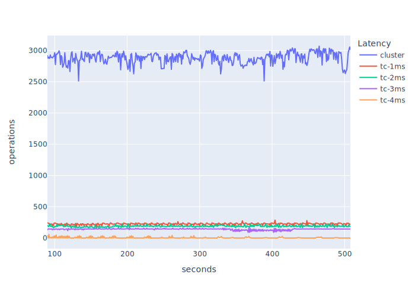
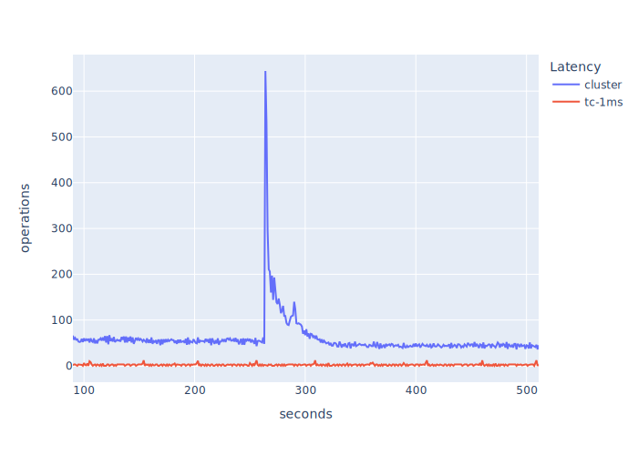
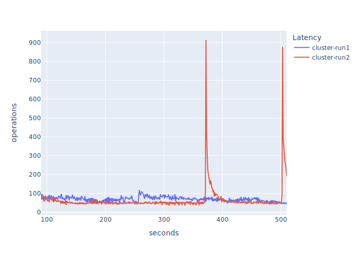
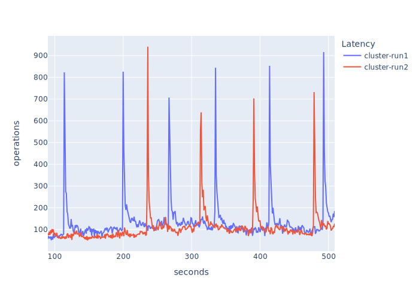

# Overview

- All VMs in the same `cluster` placement group
- Hazelcast 5.3.2 and 5.3.1 and 5.3.1
- Artificial network latency via `tc`
- Test duration is 10 minutes

See the test [configuration](test-iatomicreference-set128kb-10mins.yaml) for more details.

Latency between VMs is introduced via `tc`.

```bash
# on each member VM -- not the client
$ tc qdisc add dev ens5 root netem delay 2ms
```

The above results in pairwise latency of 4ms between members, 2ms either side of the link,
_member-member latency_. There's a latency of 2ms between the client and each respective member as a
side effect, _client-member latency_.

```bash
$ cat /etc/os-release
NAME="Ubuntu"
VERSION="20.04.3 LTS (Focal Fossa)"
ID=ubuntu
ID_LIKE=debian
PRETTY_NAME="Ubuntu 20.04.3 LTS"
VERSION_ID="20.04"
HOME_URL="https://www.ubuntu.com/"
SUPPORT_URL="https://help.ubuntu.com/"
BUG_REPORT_URL="https://bugs.launchpad.net/ubuntu/"
PRIVACY_POLICY_URL="https://www.ubuntu.com/legal/terms-and-policies/privacy-policy"
VERSION_CODENAME=focal
UBUNTU_CODENAME=focal
$ cat /proc/version
Linux version 5.11.0-1022-aws (buildd@lgw01-amd64-036) (gcc (Ubuntu 9.3.0-17ubuntu1~20.04) 9.3.0, GNU ld (GNU Binutils for Ubuntu) 2.34) #23~20.04.1-Ubuntu SMP Mon Nov 15 14:03:19 UTC 2021
$ java -version
openjdk version "21" 2023-09-19
OpenJDK Runtime Environment (build 21+35-2513)
OpenJDK 64-Bit Server VM (build 21+35-2513, mixed mode, sharing)
```

VM instances: c5.4xlarge.

## Results

 _Figure 1. Topology Latency._

| `tc` Latency | Member-Member Latency | Client-Member Latency | Topology (Figure 1) | Graph Label (Figure 2) |
| ------------ | --------------------- | --------------------- | ------------------- | ---------------------- |
| n/a          | ~55us                 | ~55us                 | n/a                 | cluster                |
| 1ms          | 2ms                   | 1ms                   | (a)                 | tc-1ms                 |
| 2ms          | 4ms                   | 2ms                   | (b)                 | tc-2ms                 |
| 3ms          | 6ms                   | 3ms                   | (c)                 | tc-3ms                 |
| 4ms          | 8ms                   | 4ms                   | (d)                 | tc-4ms                 |

Note that the latencies are approximations. The latency is very low in `cluster` placement group so
`tc` added the millis as stated; in practice the latency is normally just over.
[lagscope](https://github.com/microsoft/lagscope) was used to derive the latency for a stock
`cluster` placement of all VMs:

```bash
$ lagscope -s10.0.77.127 -Pout.json
lagscope 1.0.1
---------------------------------------------------------
13:16:51 INFO: New connection: local:25001 [socket:3] --> 10.0.77.127:6001
13:17:46 INFO: TEST COMPLETED.
13:17:46 INFO: Ping statistics for 10.0.77.127:
13:17:46 INFO: 	  Number of successful Pings: 1000000
13:17:46 INFO: 	  Minimum = 42.000us, Maximum = 359.750us, Average = 54.593us
13:17:46 INFO: Dumping latency frequency table into json file: out.json

Percentile	 Latency(us)
     50% 	 53
     75% 	 56
     90% 	 61
     95% 	 65
     99% 	 81
   99.9% 	 145
  99.99% 	 186
 99.999% 	 233
```

### 5.3.2

Test configuration is [here](test-iatomicreference-set128kb-10mins.yaml).

 _Figure 2. Throughputs with 90 second warmup and cooldown
normalisation._

| Network Latency | Min Ops/s | Max Ops/s | Mean Ops/s | StdDev |
| --------------- | --------- | --------- | ---------- | ------ |
| cluster         | 2512.00   | 3069.00   | 2881.29    | 90.13  |
| tc-1ms          | 179.00    | 286.00    | 223.96     | 14.28  |
| tc-2ms          | 162.00    | 230.00    | 189.27     | 13.45  |
| tc-3ms          | 90.91     | 160.00    | 140.07     | 11.83  |
| tc-4ms          | 0.00      | 56.00     | 4.52       | 9.63   |

### 5.3.1

Test configuration is [here](test-5_3_1-iatomicreference-set128kb-10mins.yaml).

> Running with introduced latency of 2ms per-member and beyond resulted in crashes. Therefore, I've
> presented only two runs here so we must make a comparison based on only those data points. Also, I
> ran this test twice to confirm the large op/s spike was not a one-off -- it wasn't and it's
> reproducible seemingly each test run.

 _Figure 3. Throughputs with 90 second warmup and cooldown
normalisation._

| Network Latency | Min Ops/s | Max Ops/s | Mean Ops/s | StdDev |
| --------------- | --------- | --------- | ---------- | ------ |
| cluster         | 35.96     | 644.00    | 58.93      | 45.03  |
| tc-1ms          | 0.00      | 12.00     | 2.21       | 2.01   |

### 5.3.0

Test configuration is [here](test-5_3_0-iatomicreference-set128kb-10mins.yaml).

 _Figure 4. Throughputs with 90 second warmup and cooldown
normalisation._

> I ran this twice because I expected the same peaking as 5.3.1. The first run, `cluster-run1`,
> exhibited a stabler op/s with smaller variability; however, a second run to confirm this,
> `cluster-run2`, showed the same peaking as 5.3.1.

| Network Latency | Min Ops/s | Max Ops/s | Mean Ops/s | StdDev |
| --------------- | --------- | --------- | ---------- | ------ |
| cluster-run1    | 40.96     | 118.00    | 69.28      | 12.59  |
| cluster-run2    | 34.00     | 914.09    | 65.28      | 71.10  |

### 4.2.8

Test configuration is [here](test-4_2_8-iatomicreference-set128kb-10mins.yaml).

> Ran twice as the peaking in 5.3.0 didn't manifest in the first run.

 _Figure 5. Throughputs with 90 second warmup and cooldown
normalisation._

| Network Latency | Min Ops/s | Max Ops/s | Mean Ops/s | StdDev |
| --------------- | --------- | --------- | ---------- | ------ |
| cluster-run1    | 51.00     | 916.00    | 133.03     | 100.66 |
| cluster-run2    | 49.95     | 941.00    | 108.75     | 80.20  |

# Summary

- 5.3.2 w.r.t. 5.3.1. has the following (huge) mean op/s improvements: ~49x in a `cluster` network
  profile and ~101x in `tc-1ms` network profile.
- 5.3.2 exhibits a massive dip in performance with 8ms member<->member network latency. A large
  percentage of op/s data points are 0 under this profile.
- 5.3.0 and 5.3.1 show massive occassional peaking.
- 4.2.8 shows a repeatable pattern of peaking.
