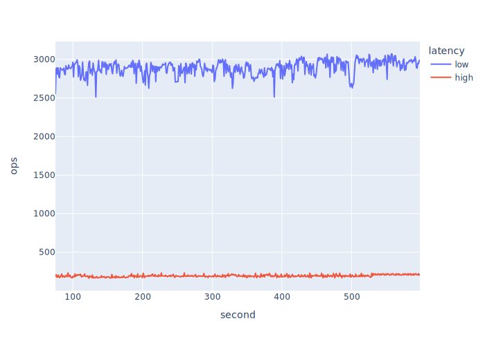

# Overview

- All VMs in the same `cluster` placement group
- Hazelcast 5.3.2
- Artificial network latency via `tc`

See the test [configuration](test-iatomicreference-set128kb-10mins.yaml) for more details.

```bash
# on each member VM
sudo tc qdisc add dev ens5 root netem delay 2ms
```

The above results in pairwise latency of 4ms between members. There's a latency of 2ms between the
client and each respective member as a side effect.


## Results

Normalised: first 75 seconds are discarded due to volatility. Where, _high_ is the run with the
network latency applied as described previously; _low_ is the stock network latency within a
`cluster` placement.



| Network Latency | Min Ops/s | Max Ops/s | Mean Ops/s | StdDev |
| --------------- | --------- | --------- | ---------- | ------ |
| Low             | 2512      | 3071      | 2894       | 92     |
| High            | 162       | 230       | 192        | 15     |
